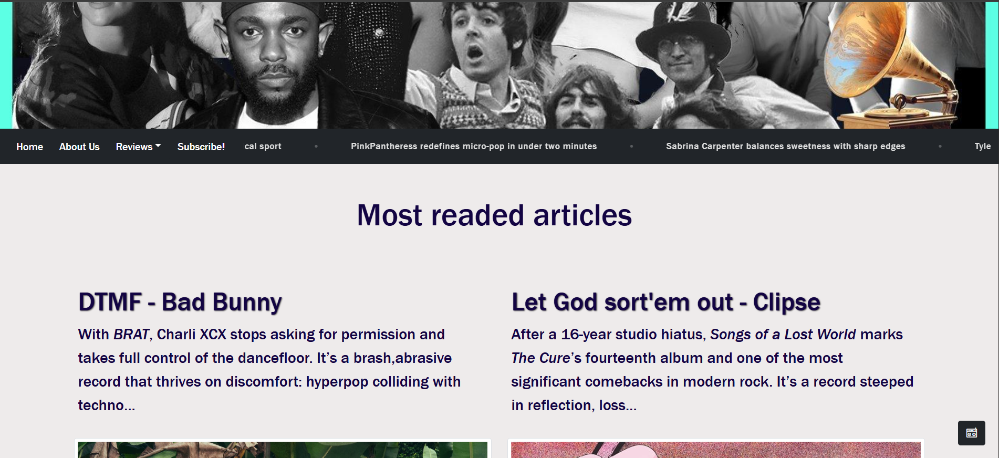
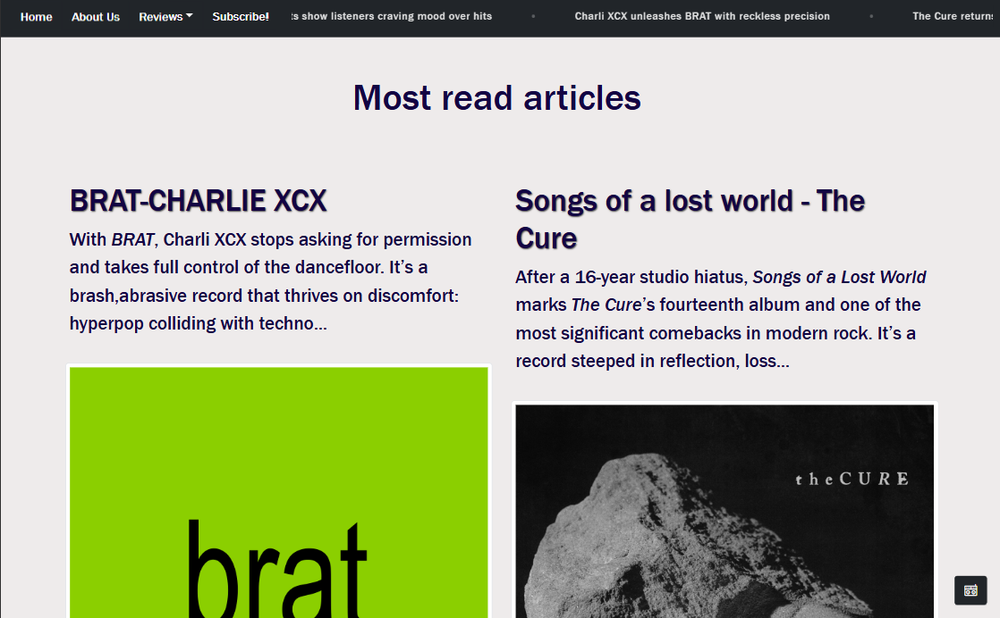
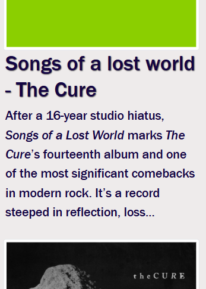
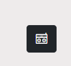
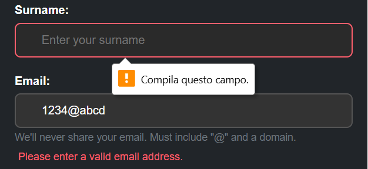
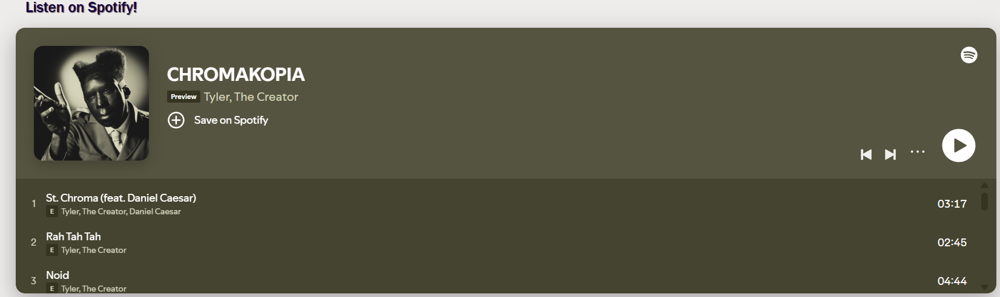

class: center, middle

# Two Cents Project

Where music, news and coding get together
.footnote[A project by Baldo Lazzara]

---

class: cover

---
class: center

# The Idea

.left-column[

## What is 2Cents?



]

.right-column[

**2Cents** is a playful university project inspired by Pitchfork, designed not just to display music reviews, but to experiment with web design and coding.

The focus of the project is:

- **Layout design**: creating a clean, visually appealing interface.

- **Interactivity**: menus, tickers, and animations that respond to user actions.

- **Responsive design**: ensuring the site works seamlessly on both desktop and mobile devices.

It’s basically a technical playground disguised as a music review site.

]

.footnote[]

---

class: center

# The Idea

.left-column[  

## Why a music review site?

### First of all: **Passion**

A genuine passion for music was the key motivation behind the project, <br>
helping both in the concept and the care put into its design and interaction choices.

]

.right-column[

Of course there are **technical reasons**

Using existing sites as an ideal blueprint allowed me to experiment with structure without creating content from scratch, focusing on **code**, **design**, and **interactivity**.

The abundance of **cross-links**, reviews, and embedded media provides a model to reproduce features like **dropdown** and **pop-up menus**, **scrolling tickers** and **Spotify player**

<video autoplay loop muted playsinline style="width:100%; border-radius:8px;">
  <source src="images/REC.mp4" type="video/mp4">
</video>

]

.footnote[]

---

class: cover1

---

class: center

# The Code

.left-column[

## What's behind the scenes?


]

.right-column[

> - **HTML** – *The structure* <br>
    >*Content, elements, code per se*<br><br>

> - **CSS** – *The style* <br>
   > *Layouts, graphics, responsiveness*<br><br>

> - **JavaScript** – *The interactivity* <br>
    > *Reaction to inputs, functionality*

There's also **Boostrap** involved!

```html
<head>
    <meta charset="UTF-8">
    <meta name="viewport" content="width=device-width, initial-scale=1.0">
    <title>2Cents - Home</title>
    <link rel="icon" href="/IMG/2cents.png" type="image/png">
    <link rel="stylesheet" href="https://cdn.jsdelivr.net/npm/bootstrap-icons@1.13.1/font/bootstrap-icons.min.css">
    <link href="https://cdn.jsdelivr.net/npm/bootstrap@5.1.2/dist/css/bootstrap.min.css" rel="stylesheet">
    <link rel="stylesheet" href="style.css">
</head>
```

]

.footnote[]

---

class: center

# The Code

.left-column[  

## What is Bootstrapping doing?

]

.right-column[
**Bootstrap** 5 is used as the main framework to manage **responsiveness** across devices.

Its **grid system** allows the layout to adapt smoothly from desktop to mobile screens without rewriting the structure.

Predefined utility classes help control **spacing**, **alignment**, and **modulation**, speeding up development.

Bootstrap components are then customized with CSS to avoid a “default” look and better fit the project’s identity.

]

.footnote[]

---

class: center

# What is Bootstrap doing?

.left-column[  



### These are two different visualizations, both for desktop and mobile screens

]

.right-column[



]

.footnote[]

---

class: center

# The Code

.left-column[  

## HOW is Bootstrap doing?

The Grid system `(container, row, col-*)` is used throughout the site to structure pages consistently.

The project is based on standard Bootstrap layout patterns rather than full pre-built themes,
the Navbar template `<nav>` was adapted and extended with custom **buttons**, **dropdowns**, and a s**crolling ticker**.

Common Bootstrap components such as **icons**, **buttons** and **forms** act as reusable templates, later customized with CSS and JavaScript.

]

.right-column[

This approach helped me to keep the work structure solid while allowing **creative freedom** on styling and interaction.

I also found some templates on <a href="https://stackoverflow.com/questions/12349985/how-to-create-a-news-ticker" style= "text-style:" > Stack Overflow </a>, like the menu button, which I customized and adapted to my work <br>

 <br>

I never thought coding community was so **cooperative** and **passionate** about their work!

]

.footnote[]

---

class: cover2

---

class: center

# The Code

.left-column[  

## How does the site come alive?

### Dynamic menus, scroll effects, and interactive elements

**JavaScript** is used to manage all the interactive parts of the site, clicking buttons triggers **dropdowns** <br>

Scrolling activates the **pop-up menu** and other animations, creating a sense of motion.
]

.right-column[

### Form validation & user feedback

JavaScript checks **input fields** in real-time, like **email addresses** requiring a valid `@` and domain, it also provides instant **visual feedback**, highlighting mistakes and guiding users toward proper input.



]

.footnote[]

---

class: center

# The Site

.left-column[

## How did the site turn out?

Overall, I hope that the website came together as a **small** but **functional** project. It’s not a real music review platform **(reviews are NOT real!)** but it *feels like* one thanks to the interactive menus, ticking news bar, and embedded Spotify players.<br>


]

.right-column[

## What works well *(I hope)*
>
> - Navigation is pretty smooth, even on mobile.

> - The layout stays consistent across different screen sizes.

> - Using Bootstrap made things easier, especially for grids and buttons.

> - In the end, it’s a funny way to put coding, design, and responsiveness all in one place.

]

---
class: center

# Conclusions

.left-column[

## What I learned

Working on this site helped me understand how **HTML**, **CSS**, and **JavaScript** ***work together***, I got hands-on experience with **Bootstrap**, but most importantly this project taught me that building a website isn’t just about *writing code*.<br>
It’s about *thinking like a user*, planning interactions, and making sure the site is **easy** and **enjoyable** to navigate.
I realized that **small details** make a **big difference** in the overall experience.<br>

In the end, I feel more confident about combining **design**, **interactivity**, and **responsiveness** in a single project, and I learned how to balance **functionality** with **style**.
]

.right-column[

## Reflections & Details

> - Bootstrap made it easy to create **grids**, **buttons**, and **responsive layouts** without starting from scratch.

> - Small **JavaScript** snippets brought the site to life: it really made the project feel like a **real platform**.

> - Testing on different devices showed me how **responsive** design affects **readability**, **spacing**, and **interactions**.

Overall, it’s satisfying to see how a simple concept can become a **functional**, **interactive** website.

]

---

class: center, middle

# Thank you.


.footnote[A project by Baldo Lazzara]

